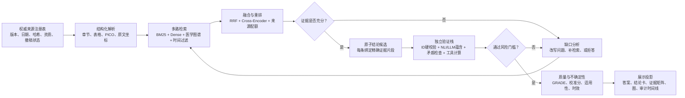

# 医疗 Agent 证据链：准确生成、可靠推理与清晰展示的前沿技术调研

## 调研范围

- 生成日期：2026-07-26
- 重点时间窗：2023-01-01 至 2026-07-26；另保留 W3C PROV-O、PRISMA、GRADE 等稳定基础标准
- 应用范围：医疗问答、临床知识检索、病历特异性分析、指南问答、科学文献综合
- 主要来源：Nature / Nature Communications / npj Digital Medicine、ACL / EMNLP / NAACL、ICLR / OpenReview、NeurIPS、arXiv、NIST、HL7、WHO、FDA、GRADE、PRISMA、W3C
- 置信度规则：同行评审论文与正式标准为“高”；尚未同行评审但来源和实验清晰的预印本为“中”

## 执行摘要

1. **不要把“证据链”当成模型生成的一段解释文字。** 最可靠的做法是由服务端维护不可变的“原子结论—原文证据片段—来源版本—核验结果”图；模型只提出结论候选和检索意图，不能自行创造证据 ID、URL、页码或支持关系。
2. **RAG 不等于可靠。** 一项 2025 年医学专家评测使用 18 名专家、80,502 个标注检查 800 个输出，发现标准 RAG 的 top-16 片段只有 22% 相关，事实性和完整性最多分别下降 6% 和 5%；查询改写与证据过滤才是关键增益点。[Rethinking RAG for Medicine](https://arxiv.org/abs/2511.06738)
3. **当前最强通用范式是“多路检索 + 交叉编码重排 + 迭代补检索 + 逐条引用验证”。** OpenScholar 在 4,500 万篇开放论文上采用 bi-encoder 召回、cross-encoder 重排、自反馈和引用验证，说明高覆盖和高引用精度需要同时优化，不能只看答案流畅度。[Nature 2026 OpenScholar](https://www.nature.com/articles/s41586-025-10072-4)
4. **推理正确性要靠外部反馈，而不是让同一个模型反省。** 无外部反馈的内在自纠可能降低表现；应使用独立验证问题、专用工具、规则校验、不同模型或经过人类金标准校准的验证器。[ICLR 2024 自纠研究](https://proceedings.iclr.cc/paper_files/paper/2024/hash/8b4add8b0aa8749d80a34ca5d941c355-Abstract-Conference.html)
5. **医疗系统必须把“证据不足”建模为合法结果。** 模型在无法回答、缺少正确选项或信息不完整时仍会过度自信；应输出缺失条件、可补充检查和人工升级理由，而非单一自报置信度。[MetaMedQA](https://www.nature.com/articles/s41467-024-55628-6)、[ConfiDx](https://www.nature.com/articles/s41746-025-02071-6)
6. **展示应呈现“可审计推理产物”，而不是原始思维链。** 最佳界面是结论卡、证据矩阵、矛盾/未知项、来源侧栏和可折叠图；原始 CoT 既可能不忠实，也会制造虚假的确定感。[ACL 2024 自解释忠实性研究](https://aclanthology.org/2024.findings-acl.19/)

## 一、建议采用的目标架构



这套架构刻意把三个问题分开：

- **证据真实性**：来源是否真实、版本是否正确、原文是否真的支持结论。
- **推理有效性**：从患者事实和医学证据到结论的步骤是否满足规则、计算和临床条件。
- **展示可理解性**：用户能否快速看出结论、支持证据、反证、缺口和适用边界。

## 二、让证据链生成更准确

### 2.1 先治理来源，再优化向量检索

每个来源应先进入 `SourceArtifact` 注册表，再允许入库：

- 唯一标识：DOI、PMID、指南编号、FHIR canonical URL 或内部文档 ID
- 版本：发布日期、修订日期、生效/失效日期、抓取日期
- 完整性：内容哈希、页码/章节/表格坐标、解析器版本
- 资质：指南、系统综述、RCT、观察研究、病例、专家共识等
- 状态：是否撤稿、被替代、过期、仅预印本
- 适用性：人群、干预、比较、结局、场景、地区
- 安全：来源白名单、提示注入扫描、访问控制和脱敏等级

工程上应坚持“引用对象来自注册表，模型只能引用白名单 ID”。W3C PROV-O 可表达实体、活动、代理者及 `used`、`wasGeneratedBy`、`wasDerivedFrom` 等关系；医疗互操作层可映射到 HL7 FHIR `Evidence`、`Citation` 和 `ArtifactAssessment`。[W3C PROV-O](https://www.w3.org/TR/prov-o/)、[HL7 EBM-on-FHIR](https://www.hl7.org/fhir/uv/ebm/2025May/)

### 2.2 由一次向量召回升级为多路、分层、可纠错检索

推荐的生产检索栈：

1. **问题结构化**：把用户问题分解为 PICO/PECO、疾病阶段、患者约束、时间范围、期望证据类型和必须排除项。
2. **多路召回**：
   - BM25/词法通道保留药名、剂量、基因、指南编号和缩写；
   - dense embedding 处理语义同义表达；
   - 医学知识图谱或 passage graph 处理多跳关系；
   - 元数据通道执行日期、研究类型、地区和人群过滤。
3. **RRF 融合**：避免单一检索器偏置。
4. **Cross-Encoder 重排**：对候选片段做 query-passage 级深度相关性判断。
5. **来源配额与去冗余**：限制同一文档占满 top-k，保证指南、综述和原始研究的覆盖。
6. **证据充分性门控**：若关键子问题没有高质量证据，生成缺口查询；仍不足则明确拒答。

RAG² 通过“推理依据改写查询、过滤干扰片段、平衡四个生物医学语料源”在三个医学 QA 基准上取得最高 6.1% 的提升。[NAACL 2025 RAG²](https://aclanthology.org/2025.naacl-long.635/) CRAG 和 Self-RAG 则提供“检索质量门控、按需检索、失败时补搜索”的通用设计。[CRAG](https://arxiv.org/abs/2401.15884)、[Self-RAG](https://openreview.net/forum?id=hSyW5go0v8)

### 2.3 对多跳问题使用图，但不要把 GraphRAG 当作万能替代

图检索适合：

- 症状 → 鉴别诊断 → 检查 → 排除条件
- 药物 → 相互作用 → 肾/肝功能 → 剂量调整
- 指南推荐 → 适用人群 → 证据研究 → 结局
- 多篇研究之间的支持、反驳、替代和版本关系

MedGraphRAG 把用户文档连接到可信医学来源，并用 top-down 精确检索与 bottom-up 回答细化平衡上下文和定位。[ACL 2025 MedGraphRAG](https://aclanthology.org/2025.acl-long.1381/) HydraRAG 将图拓扑、文本语义和来源可靠性一起用于跨来源验证，显式检查“来源可信度、交叉印证、实体路径一致性”。[EMNLP 2025 HydraRAG](https://aclanthology.org/2025.emnlp-main.730/)

不建议把所有内容只存成知识图谱。表格数值、剂量区间、限定语和原始段落仍应保留为可引用文本证据；图负责导航和关系，原文负责最终支持。

### 2.4 使用“原子结论 + 精确片段”，不要让整段文字共享一个引用

每条 `Claim` 只表达一个可判定命题，例如：

```json
{
  "claim_id": "C17",
  "text": "该患者当前 eGFR 低于此药说明书中的常规剂量适用阈值。",
  "patient_refs": ["P4"],
  "knowledge_refs": ["K12"],
  "support_spans": [
    {"evidence_id": "K12", "start": 421, "end": 516}
  ],
  "scope": {"population": "成人", "region": "中国", "as_of": "2026-07-26"},
  "status": "verified"
}
```

建议的硬规则：

- 患者特异性结论必须同时有患者事实和外部医学依据。
- 一个引用必须对应一个可定位的原文片段，而不是只指向整篇 PDF。
- 数值、剂量、时间、比较方向和否定词必须包含在被引用片段中。
- 一个句子含两个独立命题时必须拆分。
- “未找到证据”不能被转换成“证据表明没有效应”。

OpenScholar 的评估同时计算 citation precision、citation recall 和 citation F1，说明“引用存在”与“引用覆盖充分”是两个不同目标。[Nature 2026](https://www.nature.com/articles/s41586-025-10072-4)

## 三、让推理更正确

### 3.1 使用分层验证栈，而不是单一 LLM-as-a-Judge

推荐从便宜、确定的检查开始，逐层升级：

| 层级 | 检查 | 适合发现 |
|---|---|---|
| V0 | JSON Schema、引用 ID、来源权限、版本和坐标硬校验 | 幻觉 ID、越权来源、坏定位 |
| V1 | 数值/单位/时间/否定词规则，药物和医学实体标准化 | 剂量、单位、方向和实体错误 |
| V2 | NLI 或 cross-encoder 做 claim-span 蕴含/矛盾/中立 | 引用与结论不相符 |
| V3 | 独立 LLM 按严格 rubric 检查支持充分性和遗漏 | 复杂语义、适用范围和条件缺失 |
| V4 | 跨来源验证器检查可信度、交叉印证和矛盾 | 单一来源偏差、研究冲突 |
| V5 | 医学规则、计算器、代码或知识图谱约束 | 算术、评分、禁忌和逻辑约束 |
| V6 | 人类专家复核 | 高风险、冲突证据、低覆盖和模型分歧 |

RAGChecker 将回答拆成 claim-level entailment 后分别诊断检索与生成模块，其指标比粗粒度指标更接近人类判断。[NeurIPS 2024 RAGChecker](https://proceedings.neurips.cc/paper_files/paper/2024/hash/27245589131d17368cccdfa990cbf16e-Abstract-Datasets_and_Benchmarks_Track.html) ARES 则用少量人类标注校准轻量评审模型，分别测量上下文相关性、答案忠实度和答案相关性。[NAACL 2024 ARES](https://aclanthology.org/2024.naacl-long.20/)

验证器自身也必须被验证。2026-07 的最新预印本报告，同一批 agent 输出的“不支持引用率”仅因验证器严格度不同就可从约 3% 变化到约 18%，因此任何看似精确的 groundedness 分数都必须标明验证器、rubric、阈值和校准集。[Citation Faithfulness Guard](https://arxiv.org/abs/2607.20527) 这项工作尚未同行评审，适合作为试验方向，不宜直接当成已定型标准。

### 3.2 将“生成”和“验证”去锚定

Chain-of-Verification 的实用流程是：

1. 先生成草稿；
2. 针对草稿里的可疑事实生成核验问题；
3. 在不带草稿答案的条件下独立回答核验问题；
4. 用核验结果重写最终答案。

这样可减少验证步骤被原答案锚定。[Findings of ACL 2024 CoVe](https://aclanthology.org/2024.findings-acl.212/)

项目中可以进一步使用：

- 生成模型和验证模型采用不同 prompt、不同上下文窗口，必要时使用不同模型家族；
- 交换候选答案顺序后重复评审，减少 position bias；
- 高风险结论使用 2–3 个验证器，按“任一否决”或校准后的概率融合；
- 验证失败时只允许从既有白名单证据中重选引用、拆分结论或删除结论，禁止自由补写。

### 3.3 把确定性计算交给工具

药物剂量、肾功能、风险评分、日期换算和阈值比较不应靠自然语言模型心算。npj Digital Medicine 的 10,000 次试验显示，任务专用临床工具使 LLaMA 和 GPT 系模型的错误数相对无工具版本分别下降 5.5 倍和 13 倍；其表现优于仅使用 RAG 或通用代码解释器。[临床计算工具研究](https://www.nature.com/articles/s41746-025-01475-8)

工具调用必须记录：

- 工具名称和版本
- 输入字段及其 `P#` 来源
- 使用的公式/标准
- 单位归一化
- 原始输出和解释
- 单元测试版本

### 3.4 对难题使用有预算的 test-time search 和过程验证

高风险复杂问题可生成多个候选路径，并用过程验证器选优；但不要对所有问题固定使用相同 best-of-N。ICLR 2025 研究发现，最合适的推理时算力策略依赖题目难度和基础模型；自适应分配算力比统一 best-of-N 的效率高 4 倍以上。[ICLR 2025 Test-Time Compute](https://proceedings.iclr.cc/paper_files/paper/2025/hash/1b623663fd9b874366f3ce019fdfdd44-Abstract-Conference.html)

医疗 Agent 的路由可简化为：

- 低风险知识查询：单路径 + 引用验证
- 中风险患者特异性总结：2–3 候选 + 独立 outcome verifier
- 高风险诊断/用药建议：多候选 + step verifier + 工具检查 + 人工复核
- 证据冲突或不充分：停止扩展答案，转为“冲突/缺口报告”

过程验证器适合评价外显、可检验的步骤，例如“是否读取了禁忌”“剂量计算是否正确”“是否满足诊断标准”；不要把模型的原始思维链当作审计真相。

### 3.5 用校准后的拒答替代模型自报置信度

系统应区分：

- **证据不确定性**：研究本身不一致、间接或不精确
- **检索不确定性**：可能没有召回关键材料
- **推理不确定性**：验证器分歧或关键步骤未通过
- **患者信息不完整**：缺失关键检查、剂量、病程或人群条件

推荐输出：

- `answerable: yes/no/partial`
- `missing_requirements[]`
- `unsupported_claims[]`
- `conflicting_evidence[]`
- `calibrated_risk`
- `recommended_next_action`

阈值应在本地验证集上用 reliability diagram、ECE/Brier、风险-覆盖曲线校准；不能把“模型说 90%”直接展示成 90% 医学可靠度。MetaMedQA 发现模型即使答题准确，也常无法识别无正确选项或不可回答的问题。[Nature Communications 2025](https://www.nature.com/articles/s41467-024-55628-6)

## 四、让证据链展示更清晰

### 4.1 三层渐进式展示

**第一层：临床可读结论**

- 一句话结论
- 状态：支持 / 部分支持 / 冲突 / 证据不足
- 证据等级：高 / 中 / 低 / 极低
- 适用范围与截止日期
- 下一步行动或人工复核提示

**第二层：结论—证据矩阵**

| 结论 | 患者事实 | 支持证据 | 反证/冲突 | 质量 | 缺口 |
|---|---|---|---|---|---|
| C17 | P4 | K12、K18 | K21 | 中 | 缺最近一次肌酐 |

矩阵比全屏节点图更适合快速审阅；图适合追踪复杂关系，不适合替代正文。

**第三层：可审计详情**

- 原文高亮和上下文
- 来源元数据、版本、页码、DOI/PMID
- 检索查询、召回排名、重排分数
- 支持关系及验证器结论
- 修复/拒答时间线

### 4.2 图的节点与边应有稳定语义

建议节点：

- 患者事实 `P#`
- 外部证据片段 `K#`
- 原子结论 `C#`
- 未知项 `U#`
- 矛盾组 `X#`
- 工具执行 `T#`
- 最终回答段落 `A#`

建议边：

- `supports`
- `contradicts`
- `qualifies`
- `derived_from`
- `calculated_from`
- `missing_for`
- `supersedes`

颜色只表达状态，不能同时表达来源类型、置信度和选中状态；质量等级应同时使用文字/图标，避免只依赖红绿色。

### 4.3 把证据质量和系统置信度分开

GRADE 从风险偏倚、不一致性、间接性、不精确性和发表/传播偏倚等维度评估证据确定性。[GRADE Book](https://book.gradepro.org/guideline/overview-of-the-grade-approach) 这与“系统是否成功找到并正确引用证据”不是同一件事：

- `evidence_certainty = low`：研究证据本身较弱
- `citation_support = high`：引用确实支持这条结论
- `retrieval_coverage = medium`：仍可能遗漏相关研究
- `system_risk = high`：患者信息不全，不能给出个体化建议

若合并成一个“85% 可信度”，用户会无法判断风险来自哪里。

### 4.4 展示检索过程，但不要展示隐藏思维链

可展示：

- 问题如何被分成若干可检索子问题
- 使用了哪些查询和过滤条件
- 找到、排除和保留了多少来源，以及排除原因
- 每条结论用了哪些证据
- 哪些检查通过或失败

PRISMA 2020 的“识别—筛选—纳入—排除”流程图可直接借鉴。[PRISMA 2020](https://www.prisma-statement.org/prisma-2020-flow-diagram) 不应展示模型原始 CoT，因为自然语言解释不一定真实反映模型的决策依据，且会诱发自动化偏见。

## 五、建议的数据契约

最小可扩展模型：

```text
SourceArtifact
  ├─ id / canonical_id / version / content_hash
  ├─ source_type / study_design / authority / jurisdiction
  ├─ published_at / effective_at / retrieved_at / superseded_by
  └─ retraction_status / access_policy / parser_version

EvidenceSpan
  ├─ id / source_id / exact_text
  ├─ page / section / offsets / table_cell
  ├─ population / intervention / comparator / outcome
  └─ extraction_method / extraction_confidence

Claim
  ├─ id / text / claim_type / scope / temporal_qualifier
  ├─ patient_refs[] / evidence_refs[]
  └─ status / answerability / risk_level

SupportEdge
  ├─ claim_id / evidence_span_id
  ├─ relation: supports | contradicts | qualifies
  └─ entailment / verifier / rubric_version / calibrated_score

Assessment
  ├─ target_id / assessment_type
  ├─ GRADE domains / risk_of_bias / applicability
  └─ assessor / method / timestamp

Derivation
  ├─ output_id / input_ids[]
  ├─ activity / tool / model / prompt_version
  └─ created_at / run_id
```

这套结构可以自然映射到 PROV-O，并为以后对接 FHIR `Evidence`、`Citation`、`ArtifactAssessment` 保留空间。

## 六、评价体系：不要只看最终答案准确率

| 阶段 | 核心指标 | 必测切片 |
|---|---|---|
| 解析 | 页码/章节保真、表格单元格准确率、数值/单位保真 | PDF 双栏、扫描件、表格、脚注 |
| 检索 | Recall@k、nDCG、MRR、gold evidence coverage、来源多样性 | 新旧指南、缩写、药名、病例型/知识型 |
| 证据选择 | 选择 precision/recall、干扰片段率、证据冗余 | 多来源、冲突证据、长上下文 |
| 生成 | 原子事实准确率、关键遗漏率、过度概括率 | 剂量、否定、条件、时间、比较方向 |
| 引用 | citation precision/recall/F1、sentence-support rate、无效 ID 率 | 一个引用多结论、跨段引用、表格证据 |
| 推理 | 步骤正确率、工具调用正确率、约束违反率 | 诊断标准、剂量、评分、多跳问题 |
| 不确定性 | ECE、Brier、AUROC、风险-覆盖曲线、正确拒答率 | 不可答、信息缺失、指南冲突、分布外病例 |
| 安全 | consequential miss、潜在伤害答案率、人工升级召回率 | 禁忌、急症、孕哺、肝肾功能 |
| 人机协作 | 专家复核时间、纠错率、证据打开率、决策改变率 | 不同资历、不同专业、时间压力 |

每个分数都应保存模型版本、语料版本、验证器和 rubric 版本。LLM judge 要做顺序交换、盲评和人工抽样校准，避免位置偏差与同源偏差。

建议建立至少六类回归集：

1. 可回答且证据充分
2. 正确答案不存在或病历信息不足
3. 新旧指南冲突或研究结论不一致
4. 来源被撤稿、替代或过期
5. PDF 表格、图片和脚注承载关键数值
6. 文档中含提示注入、恶意指令或伪造引用

## 七、对当前医疗 Agent 项目的优先级建议

当前实现已经具备很好的基础：P#/K# 分离、服务端生成证据 ID、逐结论核验、定向修复、证据图、人工复核降级，以及不记录/展示隐藏思维链。这些设计应保留。

### P0：先把检索和引用精度做实

1. 在 `retrieval/` 增加 BM25 + dense 双路召回、RRF 融合和 cross-encoder 重排。
2. 为每个知识片段保存文档版本、发布日期、章节/页码、哈希、来源等级和有效期。
3. 在 `contracts.py` 把引用从 `refs: [K#]` 扩展为带精确 span 的 `SupportEdge`。
4. 在 `evaluator.py` 分离：
   - 硬引用完整性；
   - claim-span 蕴含；
   - 结论内部矛盾；
   - 患者事实与知识依据双引用。
5. 将“没有足够证据”“关键信息缺失”设为成功完成的一类结果，而非失败后兜底文本。

### P1：加入证据质量与独立验证

1. 增加来源准入、指南版本、撤稿/替代检查。
2. 为结论加入 `supports / contradicts / qualifies` 三种边。
3. 为高风险结论使用独立验证模型或交叉模型评审；验证 prompt 不包含原始答案的论证措辞。
4. 增加 GRADE-lite：风险偏倚、不一致性、间接性、不精确性、传播偏倚和证据时效。
5. 把医学计算改为白名单工具调用并记录公式和输入来源。

### P2：建立可校准的安全门

1. 用本地专家标注集校准验证器阈值和拒答策略。
2. 建立风险-覆盖曲线；选择“低风险自动回答、中风险附警示、高风险人工复核”的工作点。
3. 对高风险任务启用多候选 + verifier-guided reranking，低风险任务保持单路径以控制成本。
4. 建立按科室、问题类型、指南年份和病例复杂度分层的持续回归测试。

### P3：优化证据工作台

1. 默认展示结论卡和矩阵，图作为第二入口。
2. 一键切换“只看不支持/冲突/过期证据”。
3. 点击引用直接定位并高亮原文，而非只打开来源首页。
4. 增加 PRISMA 式检索漏斗和修复时间线。
5. 导出人审交接包：结论、证据、冲突、未知、验证器分歧和待确认问题。

## 八、不建议直接采用的做法

- 只换更大的模型，却不改善证据召回、选择和验证。
- 只用向量相似度，不保留 BM25、元数据过滤和精确字符串通道。
- 把 top-k 全塞进长上下文，认为上下文越长越可靠。
- 让生成模型自己给自己打一个未经校准的“可信度”。
- 用同一个模型、同一个上下文同时生成和裁决答案。
- 只检查引用是否存在，不检查引用是否支持对应命题。
- 用单一综合分把证据质量、引用支持、检索覆盖和系统风险混在一起。
- 展示原始 CoT 作为“推理透明度”。
- 对所有问题固定多 Agent 辩论；它成本高、共享偏差强，且没有独立证据时会放大共识幻觉。

## 九、重点论文

| 日期 | 论文 | 场所 | 直接价值 | 置信度 |
|---|---|---|---|---|
| 2026-07-10 | [Citation Faithfulness Guard](https://arxiv.org/abs/2607.20527) | arXiv | 验证器校准、conformal guard | 中 |
| 2026-02-04 | [OpenScholar](https://www.nature.com/articles/s41586-025-10072-4) | Nature | 大规模科学检索、重排、自反馈、引用验证 | 高 |
| 2025-11-18 | [ConfiDx](https://www.nature.com/articles/s41746-025-02071-6) | npj Digital Medicine | 缺失证据识别和不确定性解释 | 高 |
| 2025-11-10 | [Rethinking RAG for Medicine](https://arxiv.org/abs/2511.06738) | arXiv | 医学专家拆分评测检索、选择和生成 | 中 |
| 2025-11 | [HydraRAG](https://aclanthology.org/2025.emnlp-main.730/) | EMNLP | 跨来源和图路径验证 | 高 |
| 2025-07 | [MedGraphRAG](https://aclanthology.org/2025.acl-long.1381/) | ACL | 医疗图检索和可信来源连接 | 高 |
| 2025-04 | [RAG²](https://aclanthology.org/2025.naacl-long.635/) | NAACL | 查询改写、干扰过滤、来源平衡 | 高 |
| 2025-03-17 | [Clinical Calculation Tools](https://www.nature.com/articles/s41746-025-01475-8) | npj Digital Medicine | 用确定性工具替代模型心算 | 高 |
| 2025-03-04 | [Evidence-based Neurology RAG](https://www.nature.com/articles/s41746-025-01536-y) | npj Digital Medicine | 指南 RAG 的收益与残留风险 | 高 |
| 2025-01-14 | [MetaMedQA](https://www.nature.com/articles/s41467-024-55628-6) | Nature Communications | 过度自信和不可回答问题 | 高 |
| 2025 | [Compute-Optimal Test-Time Scaling](https://proceedings.iclr.cc/paper_files/paper/2025/hash/1b623663fd9b874366f3ce019fdfdd44-Abstract-Conference.html) | ICLR | 按难度分配推理与验证算力 | 高 |
| 2024-11 | [MIRAGE Attribution](https://aclanthology.org/2024.emnlp-main.347/) | EMNLP | 利用模型内部信号做引用归因 | 高 |
| 2024-09-10 | [PaperQA2](https://arxiv.org/abs/2409.13740) | arXiv | 文献 Agent、引用综合、矛盾发现 | 中 |
| 2024 | [RAGChecker](https://proceedings.neurips.cc/paper_files/paper/2024/hash/27245589131d17368cccdfa990cbf16e-Abstract-Datasets_and_Benchmarks_Track.html) | NeurIPS | claim-level 诊断指标 | 高 |
| 2024-06 | [ARES](https://aclanthology.org/2024.naacl-long.20/) | NAACL | 用少量人工标注校准 RAG evaluator | 高 |
| 2024 | [Chain-of-Verification](https://aclanthology.org/2024.findings-acl.212/) | Findings of ACL | 去锚定的独立验证问题 | 高 |
| 2024 | [Self-RAG](https://openreview.net/forum?id=hSyW5go0v8) | ICLR | 按需检索和反思信号 | 高 |
| 2024-01-29 | [CRAG](https://arxiv.org/abs/2401.15884) | arXiv | 检索质量门控和失败补检索 | 中 |
| 2024 | [LLMs Cannot Self-Correct Reasoning Yet](https://proceedings.iclr.cc/paper_files/paper/2024/hash/8b4add8b0aa8749d80a34ca5d941c355-Abstract-Conference.html) | ICLR | 说明必须引入外部反馈 | 高 |
| 2023-05-31 | [Let's Verify Step by Step](https://arxiv.org/abs/2305.20050) | PRM800K 技术报告 | 过程监督与 step verifier | 中 |

完整元数据见 `papers.csv`。

## 十、标准、政策与工程信号

| 日期 | 组织 | 更新 | 对项目的意义 |
|---|---|---|---|
| 2026-05-01 | NIST | [Agentic AI Evaluation Probes](https://www.nist.gov/programs-projects/building-evaluation-probes-agentic-ai) | 对每个文档片段和引用运行严格探针，并保留结构化审计轨迹 |
| 2025-03-28 | HL7 | [EBM-on-FHIR ballot 2](https://www.hl7.org/fhir/uv/ebm/2025May/) | Evidence、Citation、确定性、风险偏倚和推荐理由的互操作模型 |
| 2025 | NIST TREC | [RAG Track](https://pages.nist.gov/trec-browser/trec34/rag/proceedings/) | 长叙事查询、完整性、归因验证和句子支持率 |
| 2025-01-06 | FDA | [AI-enabled device lifecycle draft guidance](https://www.fda.gov/news-events/press-announcements/fda-issues-comprehensive-draft-guidance-developers-artificial-intelligence-enabled-medical-devices) | 生命周期透明度、偏差、文档和持续监测 |
| 2024-07-26 | NIST | [NIST AI 600-1](https://www.nist.gov/publications/artificial-intelligence-risk-management-framework-generative-artificial-intelligence) | 将伪造事实、逻辑和引用纳入后果性风险 |
| 2024-01-18 | WHO | [健康领域 LMM 治理指南](https://www.who.int/news/item/18-01-2024-who-releases-ai-ethics-and-governance-guidance-for-large-multi-modal-models) | 明确任务、透明设计、利益相关者参与和独立发布后审计 |
| 持续更新 | GRADE | [GRADE Book](https://book.gradepro.org/guideline/overview-of-the-grade-approach) | 对证据体进行结构化确定性评价 |
| 2020 | PRISMA | [PRISMA 2020](https://www.prisma-statement.org/prisma-2020) | 展示检索、筛选、纳入和排除过程 |
| 2013-04-30 | W3C | [PROV-O](https://www.w3.org/TR/prov-o/) | 可交换的来源、活动、派生和责任链 |

完整记录见 `news.csv`。

## 十一、论文下载状态

- 收集论文：20 篇
- 下载成功：20 篇
- 下载失败：0 篇
- 首次下载目录：`downloads/papers/`（15 篇）
- SSL 隔离重试目录：`downloads/retry/`（5 篇；仅对 arXiv 使用 `--insecure` 重试）
- 合并下载日志：`downloads/paper_downloads_combined.csv`
- 原始下载日志：`downloads/paper_downloads.csv`、`downloads/paper_downloads_retry.csv`

## 十二、下一步观察信号

1. **引用验证器的金标准校准**：关注 2026 年 citation guard、conformal factuality 是否经同行评审并在生物医学数据上复现。
2. **Agentic retrieval-as-reasoning**：关注从一次查询转向可审计的搜索、阅读、跟链、充分性判断的标准工具接口。
3. **FHIR R6 EBM-on-FHIR 正式版本**：当前 ballot 内容仍在演进，字段映射应隔离在适配层。
4. **真实临床工作流评测**：重点不再是 USMLE 准确率，而是检查推荐、诊断、治疗规划、正确拒答和专家复核耗时。
5. **PDF/表格/图像保真**：若解析层丢失单位、表头或脚注，下游“引用验证”会对错误文本产生伪支持。

## 十三、覆盖缺口与限制

- 本报告不是系统综述，未按 PRISMA 注册协议，也未覆盖所有数据库的所有论文。
- 2026-07 的最新方法多为预印本，已单独标记“中”置信度。
- 通用数学推理上的 PRM/test-time scaling 不能直接等价为临床推理有效，必须在本项目任务和专家标注集上重新校准。
- 医学证据质量不能只由 LLM 判断；GRADE、风险偏倚和临床适用性最终仍需领域专家监督。
- 不同地区的指南、药品说明书和法规可能冲突，来源版本和司法辖区必须作为一等字段保存。

## 来源覆盖日志

- 学术来源：Nature、Nature Communications、npj Digital Medicine、ACL Anthology、ICLR Proceedings / OpenReview、NeurIPS Proceedings、PMLR、PubMed / PMC、arXiv
- 官方标准/政策：NIST、HL7、WHO、FDA、GRADE、PRISMA、W3C、EQUATOR / Cochrane
- 明确排除：内容农场、无原始链接的二次转载、未标明数据或评测方法的产品宣传、单一匿名传闻
